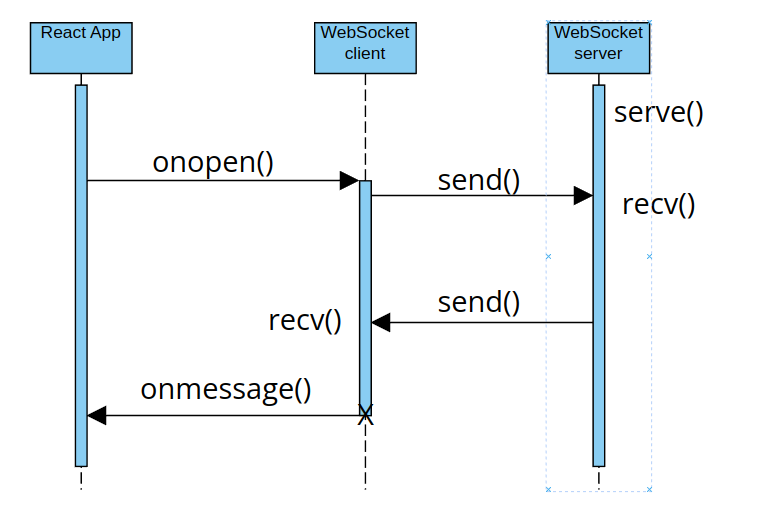

# Bookstore Microservice

## Communication Contract
Communication with the reading level server must be performed using the WebSocket API.

An example of the WebSocket API within React is as follows. The function submitReadingText can be bound to a button, and will open a client socket for communication with the reading level server.

    const submitReadingText = async () => {
        console.log(reading_text)
        
        let ws = new WebSocket('ws://localhost:8999');

        ws.onopen = () => {
            ws.send(reading_text);
        };
        
        ws.onmessage = e => {
            let reading_grade_level = e.data;
            console.log(`The reading grade level is ${reading_grade_level}`);
        };
    
        ws.onerror = e => {
            console.log(e.message);
        };
    
        ws.onclose = e => {
            console.log(e.code, e.reason);
        };
    }

### Requesting Data
The entire text must be sent at once to the server. From the preceding example:

    ws.onopen = () => {
        ws.send(reading_text);
    };

The .open() method will be executed upon the creation of the client socket. Here, the .send method is then called with the entire text.

### Receiving Data
The reading level will be returned from the server as a string. From the preceding example:

    ws.onmessage = e => {
        let reading_grade_level = e.data;
        console.log(`The reading grade level is ${reading_grade_level}`);
    };

This method will be activated upon receipt of a message from the server. Any state variables or functions that use the reading level should be written within this method.

## Starting the Server
The server requires the WebSocket, asyncio, and re libraries to run. Ensure that you have these installed before attempting to start the server.

On the command line, in the same folder that stores the server script, run the following: python3 react-server.py
